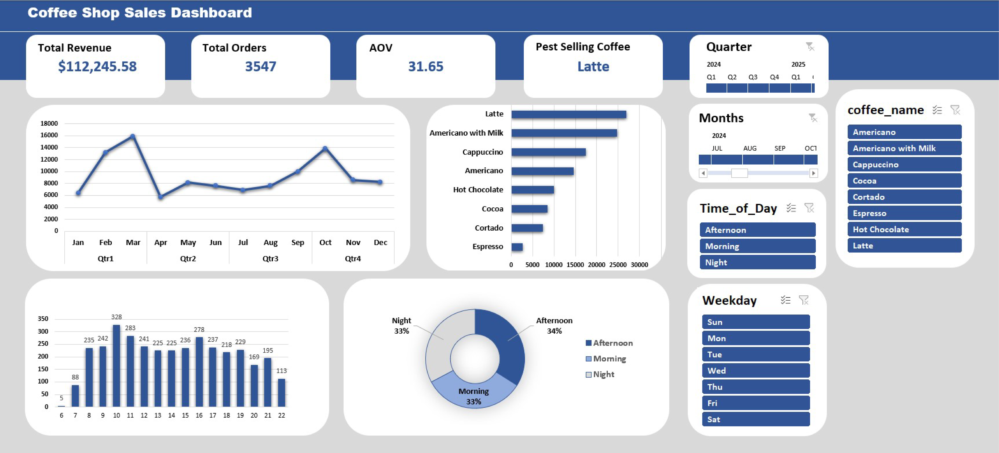

# coffee-sales-dashboard
Data analysis project using Excel to visualize coffee sales trends and business insights.

Features
- KPI Cards
- Sales Trend Analysis
- Interactive Slicers & Timeline
- Top-Selling Products Analysis
- Customer Insights

Key Insights
- Latte was the top-selling product ☕
- Total Revenue exceeded 112K+
- 3.5K+ customer orders analyzed
- Average Order Value: 31.56

Tools Used
- Microsoft Excel
- Pivot Tables
- Pivot Charts
- Slicers & Timeline

📷 Dashboard Preview

Author
Mohamed Ashraf – Data Analyst
